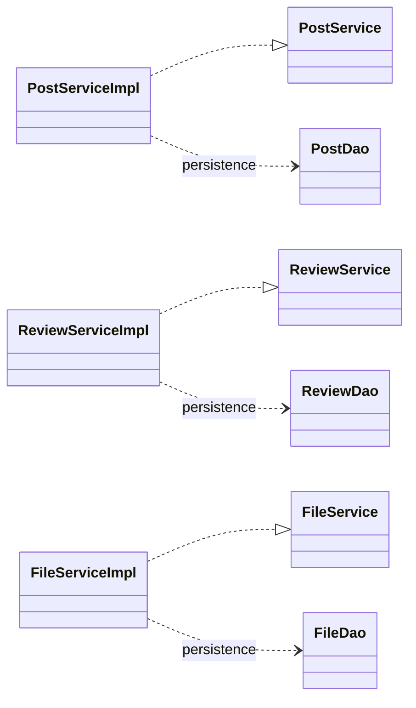
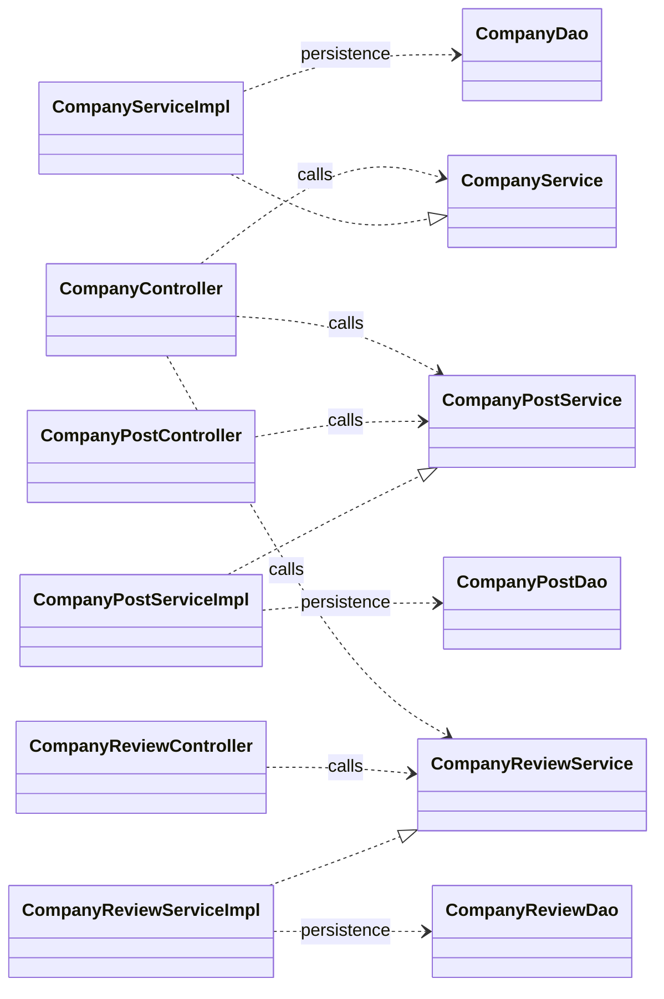
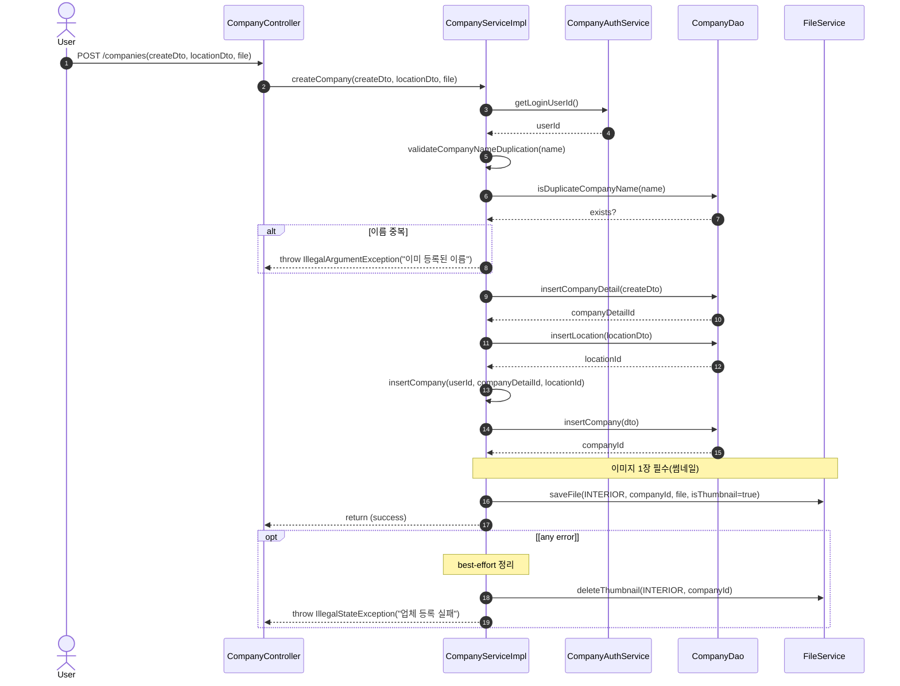
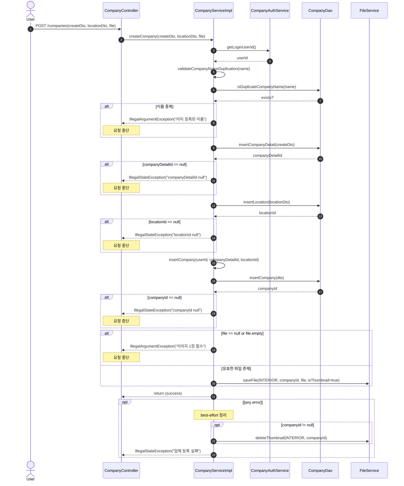
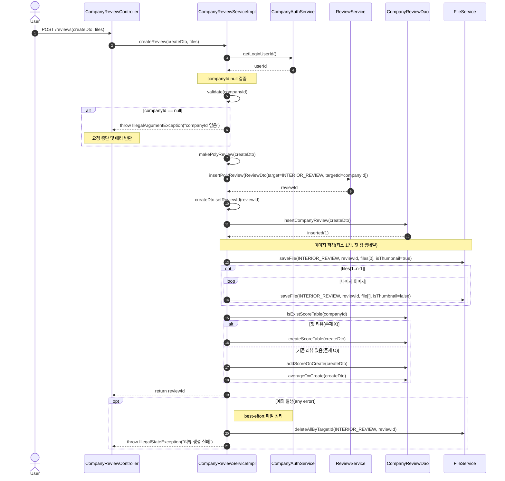
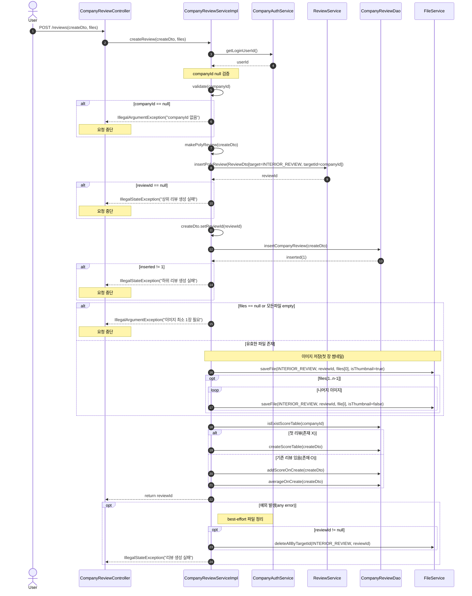

# 인테리어 커머스 통합 플랫폼
> 다형성 기반 공통 테이블(post, review, comment, file, report)을 중심으로  
> 도메인 간 경계를 재정의하고 구조적 일관성을 확보한 인테리어 커뮤니티 웹 서비스

---

## 프로젝트 개요
- **유형:** 팀 프로젝트
- **기간:** 2025.07.11 ~ 2025.08.14  
- **인원:** 백엔드 5명
- **팀 구성:** 회원 / 커뮤니티 / 인테리어 / 쇼핑 / 관리자
- **역할:** 팀장 / 업체·게시글·리뷰 도메인 개발 / 공통·다형 구조 및 파일 보상 로직 설계

---

## 기술 스택
| 구분 | 기술 |
|------|------|
| **Backend** | Java 17 · Spring Boot 3.5.3 · MyBatis 3.0.3 |
| **Frontend** | JSP · HTML · CSS |
| **DB** | MariaDB 11.8 (Driver 3.3.3) |
| **Build/IDE** | Maven · IntelliJ IDEA 2024.3 · STS 4.25 |
| **Test** | JUnit 5 · Mockito 5.14.2 |
| **Infra/DevOps** | AWS EC2 · Jenkins · GitHub Actions |
| **Security** | Spring Security · AOP Logging |

---

## 패키징 / 배포
- Jenkins + GitHub Actions 기반 CI/CD 실습
- AWS EC2 환경에 자동 배포 파이프라인 구축 및 동작 검증 경험(main 푸시 시 자동 반영)
- WAR 패키징 사용

---

## 프로젝트 요약
인테리어 업체와 사용자가 연결되는 커뮤니티형 웹 서비스입니다.
공통 테이블(post, review, comment, file, report)에 다형성 구조(target_type + target_id)를 적용하여
게시글·리뷰·댓글 등 다양한 도메인을 통합 관리하고, 도메인 간 책임 경계를 명확히 함

## 핵심 구현
### 공통 테이블 기반 다형성 구조 설계  
게시글·리뷰·댓글·파일 등 중복 테이블을 **다형성(`target_type`, `target_id`) 기반 공통 구조**로 통합. 초기에 추적성과 관리 효율을 높이려 했지만, 도메인별 필드 의미 차이로 **공통 계층의 책임 경계가 모호**해짐. 공통 Mapper에 유사 쿼리와 네이밍 존재하고 공통 코드 수정 시 도메인 전체에 영향이 발생하는 문제 확인

이에 공통 테이블에는 `id`, `target_id`, `target_type`, `created_at` 등 **식별/메타 역할만 유지**하고, 각 도메인의 속성과 로직은 개별 Mapper·Service 단위로 분리함. 다형성 구조는 유지하되, 공통 계층을 얇게 만들어 **중복 제거와 유지보수성**을 모두 확보. 또한 `target_type/id` 조합으로 도메인 추적으로 **관리자 로그·신고 집계 등 통합 관리**가 가능함
 
 

### 성능보다 유지보수를 택한 조회 구조 설계
게시글 목록과 대표 썸네일을 함께 조회하는 과정에서, 향후 구조 확장이 예정되어 있어 **변경에 유연한 설계 방향**을 우선함

복합 쿼리를 사용하면 순간 성능은 더 좋지만, 스키마 변경 시 전체 SQL을 수정해야 하는 부담이 발생. 이에 **IN 배치 방식**으로 전환해 게시글 목록을 한 번에 조회한 뒤, ID 리스트 기반으로 썸네일을 일괄 조회하도록 개선.

결과적으로 **DB 왕복 횟수를 N건 -> 2회(목록 1 + 썸네일 1)** 로 줄이며 **성능은 충분히 확보하면서도**, 확정되지 않은 개발 구조 내에서 리스크를 최소화할 수 있는 **유지보수성과 확장성 중심의 구조적 선택**을 택함.

이 방식은 다형성(`target_type`, `target_id`) 구조와도 호환되어, 향후 게시글 외 리뷰·프로젝트 등 다른 도메인으로의 확장성 역시 보장됨
 
 

### 테스트 기반 품질 확보
Mapper·Service 중심으로 테스트를 작성해 주요 로직의 안정성을 검증함. **총 130개의 테스트 케이스**를 통해 리뷰 평균 계산 시 발생한 0건 처리 오류를 **테스트로 조기 발견·수정**하였고, Mock 기반 검증으로 입력·권한·예외·파일 정책 등 핵심 흐름을 정검함.

**JaCoCo 커버리지:** 라인 56% / 브랜치 52%  
**CI 파이프라인:** Jenkins 기본 설정으로 테스트 통과 시에만 배포가 진행되어, 결과적으로 배포 안정성을 확보함.
 
 

---

## 담당 기능 요약 
|기능|설명| 
|--|--| 
|**공통 구조 설계**| `post`/`review`/`comment`/`file`/`report` 테이블 기반 다형성 매핑 (`target_type`, `target_id`) 설계 | 
|**업체 관리**| 상세·위치·기본정보 3단계 등록 트랜잭션 / 썸네일 업로드 및 `soft delete` | 
|**게시글**| 상위 post + 하위 company_post 구조 / 썸네일 자동 지정 / 수정·삭제 권한 검증(실삭제) | 
|**리뷰/평점**| 상하위 review 구조 / 평균·합계 자동 갱신 / 삭제 시 점수 재계산 및 평균 보정 | 
|**댓글**| 단일 테이블 계층형 구조 / `soft delete`(작성자만 수정·삭제 가능) |

---

## 시스템 구조(클래스 다이어그램)
> **common**

 
 

> **interior**

> 두 다이어그램은 `target_type` / `target_id` 다형성 키로 연결됨

---

## 시퀀스 다이어그램
### 업체 등록

### 업체생성222

### 리뷰 생성

### 리뷰 생성22

## 개선 제안 및 향후 계획
- 파일 업로드를 temp -> linked -> final 단계로 분리하여 트랜잭션 병목 완화 구조 구상 중
- rootId 기반 생성/삭제 단일 트랜잭션 구조로 상·하위 도메인 연결 단순화 계획
- 리뷰 과다 작성 방지를 위한 24시간 제한 로직 추가 예정

## 주요 화면

## Links

